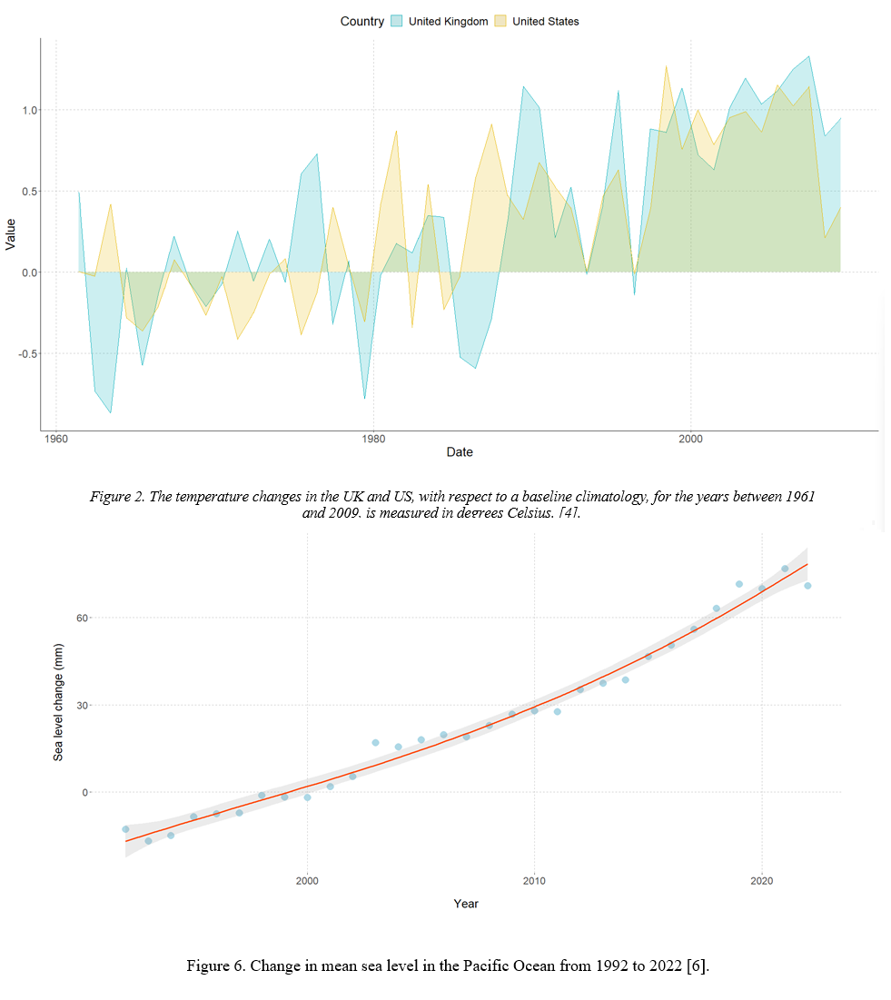

<h1 align="center">Climate Change Data Analysis Visualization</h1>  

    

 

## Table of Contents

- [Demo](#demo)
- [Introduction](#introduction)
- [Technologies](#technologies)
- [Features](#features)
- [Contributors](#contributors)

 

## Demo

    

 

## Introduction

In this project, which we worked with R, we focused on climate change and its impact on nature. After obtaining the data from various sources, we performed the necessary data cleaning and generated figures, graphs, and tables. At the end we prepared a detailed report.

 

## Technologies

* R (ggplot2)

 

## Features

* 8 figure, 1 table and graphical abstract tables provided.
* Data and sources are provided.
* R scripts about figures provided.
* Detailed descriptive and inferential analysis are provided in report.

 

## Contributors

